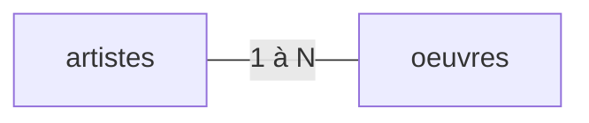
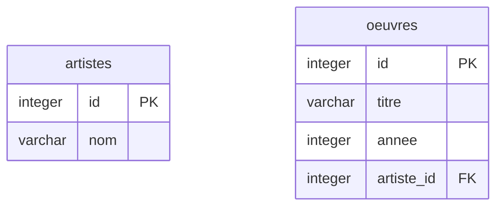

---
layout: grid
cols: 3
---

# Ce cours dans la formation

A travers le cycle de vie de la donnée : 

<Card title="Modélisation" color="red" footer="ModelDon · semestre 1">
<template #icon><pixelarticons-tree /></template>
Structurer et formaliser les données d'un domaine métier. <strong>Ce cours.</strong>
</Card>
<Card title="Infrastructure" color="#6b7280" footer="InfraDon · semestre 2">
<template #icon><pixelarticons-server /></template>
Stocker, gérer et exposer des données fiables et accessibles à grande échelle.
</Card>
<Card title="Visualisation" color="#6b7280" footer="VisualDon · semestre 5">
<template #icon><pixelarticons-chart-bar /></template>
Représenter les données pour en tirer du sens et appuyer les décisions.
</Card>


---
layout: section
---

# Données et information

---
layout: grid
cols: 3fr 1fr 3fr 1fr 3fr
align: stretch
content: center
clicks: 2
---

# Donnée <pixelarticons-arrow-right  class="text-3xl" /> Information <pixelarticons-arrow-right class="text-3xl" /> Connaissance


<Card title="Données brutes" :at="0">
<template #icon><pixelarticons-database /></template>
<ul>
  <li>47</li>
  <li>4</li>
  <li>8</li>
</ul>
</Card>
<pixelarticons-arrow-right v-click="1" class="text-3xl self-center" />
<Card title="Information" :at="1">
<template #icon><pixelarticons-article /></template>
47 inscrit·e·s au cours, 4 présent·e·s en salle, 8 heures du matin
</Card>
<pixelarticons-arrow-right v-click="2" class="text-3xl self-center" />
<Card title="Connaissance" :at="2">
<template #icon><pixelarticons-lightbulb /></template>
Le créneau de 8h ne convainc personne : déplacer le cours à 8h30
</Card>


---
layout: section
---

# Du tableur à la base de données

---
layout: two-cols
---

::title::
# Le tableur

::left::

- **Visibles** : toutes les données tiennent à l'écran
- **Immédiat** : aucun outil à installer
- **Sans formation** : tout le monde sait déjà s'en servir
- **Limité** : quelques centaines de lignes, sur un seul poste (à part si c'est un fichier partagé en ligne...)

::right::

<Card title="Propriétaire">
<template #icon><pixelarticons-lock /></template>
<strong>Microsoft Excel</strong> · <strong>Apple Numbers</strong><br>Licence payante, format contrôlé par l'éditeur.
</Card>
<Card title="Libre et open source">
<template #icon><logos-opensource /></template>
<strong>LibreOffice Calc</strong> · <strong>Gnumeric</strong><br>Gratuit, format ouvert (<code>.ods</code>).
</Card>
<Card title="En ligne et collaboratif">
<template #icon><pixelarticons-cloud /></template>
<strong>Google Sheets</strong> · <strong>Framacalc</strong><br>Édition à plusieurs, données hébergées par un tiers.
</Card>

---
layout: default
---

# Limites (1/2)

### oeuvres_v2_FINAL_ok.xlsx

|  | A | B | C | D |
|---|---|---|---|---|
| **1** | Œuvre | Artiste | Année | Salle |
| **2** | Impression, soleil levant | Claude Monet | 1872 | S1 |
| **3** | Le Bassin aux nymphéas | claude monet | 1899 | Salle 1 |
| **4** | La Nuit étoilée | Vincent van Gogh | 1889 | S2 |
| **5** | La Nuit étoilée | Vincent van Gogh | 1889 | S2 |
| **6** | La Grande Vague de Kanagawa | Katsushika Hokusai | vers 1831 |  |

<Card color="#e92528" title="Repérer les anomalies">
<template #icon><pixelarticons-zoom-in /></template>
Combien de problèmes distincts se cachent dans ce tableur ?
</Card>


---
layout: default
---

# Limites (2/2)

| Dans le tableur | Ce qu'il faudrait |
|---|---|
| `oeuvres_v2_FINAL_ok.xlsx` | Une **seule** source de vérité |
| « Claude Monet » et « claude monet » | Une valeur saisie **une seule fois** |
| `S1` et `Salle 1` pour la même salle | Une **référence** unique vers la salle |
| `vers 1831`, cellule Salle vide | Un **type** et des **contraintes** par colonne |
| Lignes 4 et 5 identiques | Une **clé** qui interdit le doublon |

<Card color="#e92528" title="Pas de filet de sécurité">
<template #icon><pixelarticons-shield-off /></template>
Excel n'empêche rien : ni la cellule fantaisiste, ni les éditions simultanées, ni la suppression irrécupérable.
</Card>


---
layout: grid
cols: 3fr 1fr 3fr 1fr 3fr 1fr 3fr
align: stretch
content: center
clicks: 3
---

# Étapes de la modélisation

<Card title="Séparer" :at="0" footer="cours 02 · Modèle entité-association">
<template #icon><pixelarticons-scissors /></template>
Repérer les entités, leurs attributs et leurs relations
</Card>
<pixelarticons-arrow-right v-click="1" class="text-3xl self-center" />
<Card title="Décrire" :at="1" footer="cours 03 · Clés et relations">
<template #icon><pixelarticons-git-branch /></template>
Dessiner entités, attributs et relations
</Card>
<pixelarticons-arrow-right v-click="2" class="text-3xl self-center" />
<Card title="Créer" :at="2" footer="cours 05 · Stockage local">
<template #icon><pixelarticons-table /></template>
Le diagramme devient des <code>CREATE TABLE</code> typés
</Card>
<pixelarticons-arrow-right v-click="3" class="text-3xl self-center" />
<Card title="Interroger" :at="3" footer="cours 06 · Interroger les données">
<template #icon><pixelarticons-search /></template>
Les données entrent, les réponses sortent en SQL
</Card>


---
layout: two-cols
---

::title::
# Les outils du cours

::left::

### dbdiagram.io

- Diagramme E-R dans le navigateur
- Entités, attributs, cardinalités
- Export en image et en fichier source
- Rien à installer
- Cours 02 à 04



::right::

### SQL

- **S**tructured **Q**uery **L**anguage
- Crée les tables, insère les données
- Interroge, croise, calcule des indicateurs
- Exécuté par le SGBD
- Cours 05 à 08

```sql
CREATE TABLE artistes (
  id INTEGER PRIMARY KEY,
  nom TEXT NOT NULL
);

CREATE TABLE oeuvres (
  id INTEGER PRIMARY KEY,
  artiste_id INTEGER REFERENCES artistes(id)
);
```

---
layout: grid
cols: 2
content: center
---

# Liens utiles

<Card title="Slides du cours">
<template #icon><pixelarticons-external-link /></template>
<a href="https://comem-modeldon.onrender.com">comem-modeldon.onrender.com</a><br>
Tous les cours du semestre, mis à jour au fil des séances.
</Card>

<Card title="Dépôt du cours">
<template #icon><logos-github-icon /></template>
<a href="https://github.com/romanoe/comem-modeldon">github.com/romanoe/comem-modeldon</a><br>
Sources des slides, corrections et historique des versions.
</Card>

---
layout: section
---

# Base de données et SGBD

---
layout: two-cols
---

::title::
# Base de données

::left::

<Card title="Stocker">
<template #icon><pixelarticons-save /></template>
Les données survivent à l'arrêt du programme.
</Card>
<Card title="Organiser">
<template #icon><pixelarticons-layout /></template>
Selon un modèle cohérent, sans doublon ni ambiguïté.
</Card>
<Card title="Accéder">
<template #icon><pixelarticons-search /></template>
Rapidement, avec des critères précis.
</Card>

::right::

### Définition

- Données **structurées** et **persistantes**
- Gérée par un logiciel qui garantit la cohérence

<br>

### Garanties

- Une **seule** source de vérité
- Des données qui **survivent** aux erreurs
- Des réponses obtenues par **requête**, pas à l'oeil

---
layout: two-cols
---

::title::
# SGBD

::left::

Un **Système de Gestion de Base de Données** stocke les données, garantit leur cohérence et répond aux requêtes de plusieurs utilisateur·rice·s. 

Deux **types** : 

* **OLTP** (`Online Transaction Processing`)  Écritures fréquentes et courtes : vendre un billet, enregistrer une visite.

* **OLAP** (`Online Analytical Processing`) : Lectures massives pour décider : chiffre d'affaires, fréquentation des salles.

::right::

### Quelques SGBD relationnels

<Card title="SQLite" color="#e92528" footer="Utilisé dans ce cours · contexte OLTP">
<template #icon><logos-sqlite /></template>
Embarqué : un seul fichier, aucun serveur.
</Card>
<Card title="PostgreSQL" footer="InfraDon · 
semestre 2">
<template #icon><logos-postgresql /></template>
Client-serveur, riche et extensible.
</Card>
<Card title="MySQL">
<template #icon><logos-mysql /></template>
Client-serveur, très répandu sur le web.
</Card>


---
layout: section
---

# Raisons de modéliser

---
layout: grid
cols: 2
---

# Objectifs

<Card title="Organiser l'information">
<template #icon><pixelarticons-list /></template>
Structurer les données pour qu'elles soient cohérentes, sans doublons, sans ambiguïté.
</Card>
<Card title="Définir les relations">
<template #icon><pixelarticons-git-branch /></template>
Exprimer les liens entre les entités du domaine : visiteur, exposition, œuvre.
</Card>
<Card title="Besoins métier">
<template #icon><pixelarticons-clipboard-note /></template>
Collecter les exigences du domaine d'application avant de concevoir quoi que ce soit.
</Card>
<Card title="Modèle optimal">
<template #icon><pixelarticons-check-double /></template>
Un bon modèle garantit que les données sont interrogeables, maintenables et évolutives.
</Card>

---
layout: section
---

# Le diagramme entité-association (Entity-Relation)

---
layout: two-cols
---

::title::
# Entités, attributs, relations

::left::

- **Entité** : un objet du domaine
- **Attribut** : ce qu'on sait de l'objet
- **Relation** : le lien entre deux entités
- **Cardinalité** : combien d'un côté, combien de l'autre

::right::




---
layout: default
---

# Du diagramme aux tables

Chaque élément du diagramme a une traduction directe dans la base de données : 


| Dans le diagramme (Cours 2) | Dans la base de données (Cours 5)|
|---|---|
| Entité | Table |
| Attribut | Colonne |
| Attribut identifiant | Clé primaire |
| Relation 1:N | Clé étrangère |
| Relation N:M | Table de liaison |

Dessiner d'abord, implémenter ensuite !

---
layout: section
---

# Objectifs du cours

---
layout: two-cols
---

::title::
# Objectifs

::left::

- **Structurer** des données dans un **modèle relationnel** adapté à un domaine métier
- **Modéliser** un problème réel sous forme d'**entités**, d'**attributs** et de **relations**
- **Traduire** un diagramme entité-association en **schéma SQL** exploitable
- **Interroger** et **transformer** des données pour répondre à des besoins métier
- **Analyser** des données structurées pour produire des **indicateurs** et des **statistiques**

::right::

<Figure
  class="w-2/3 mx-auto framed"
  src="/images/01/fiche-de-cours.png"
  caption="<a href='https://gaps.heig-vd.ch/consultation/fiches/uv/uv.php?id=8125&amp;plan=941&amp;type=PDF' target='_blank' rel='noopener'>Fiche d'unité</a>"
  href="https://gaps.heig-vd.ch/consultation/fiches/uv/uv.php?id=8125&amp;plan=941&amp;type=PDF"
  alt="Fiche d'unité de cours Modélisation de données"
/>


---

# Compétences par cours

| # | Cours | Compétences |
|---|---|---|
| 01 | Introduction | Distinguer données, information et connaissance |
| 02 | Modélisation | Concevoir un modèle E-R à partir d'un besoin métier |
| 03 | Clés et relations | Définir des clés primaires, étrangères et des relations |
| 04 | Normalisation | Détecter la redondance et appliquer les formes normales |
| 05 | Stockage | Créer et structurer une base SQLite |
| 06 | Interroger | Lire, filtrer et modifier des données |
| 07 | Connecter | Relier des tables avec des jointures |
| 08 | Analyser | Agréger des données et créer des vues |
| 09 | Semi-structuré | Lire et produire du JSON |

---
layout: section
---

# Évaluation

---
layout: two-cols
---

::title::
# Répartition

::left::

<Card title="Examen intermédiaire · 50%">
<template #icon><pixelarticons-edit-box /></template>
Mi-semestre · Format papier · Questions ouvertes · QCM
</Card>

::right::

<Card title="Examen final · 50%" color="#16a34a">
<template #icon><pixelarticons-edit-box /></template>
Période jan-fev · Format papier · Questions ouvertes · QCM
</Card>

---
layout: default
---

# Examen intermédiaire

Format papier, à mi-semestre. Même forme que l'examen final.

| Élément | Détail |
|---|---|
| Programme | Modélisation et création des tables : cours 01 à 05 |
| Format | Questions ouvertes et QCM |
| Support | Papier, sans machine |
| Poids | 50% de la note finale |

---
layout: section
---

# Travaux pratiques

---

# Le fil rouge

- Groupes de **2-3 personnes** : un·e chef·fe de projet, un ou deux architectes de données
- Un seul domaine, du premier au dernier cours : **un musée**
- Aucun rendu noté : les TP préparent les deux examens
- Chaque séance applique au musée ce qui vient d'être vu
- À l'arrivée : un modèle complet, une base, des requêtes

---

# Travail en TP

Chaque séance produit de quoi réviser :

| Production | Format |
|---|---|
| Diagramme E-R | Image et fichier source exportés de dbdiagram.io |
| Schéma SQL | Fichier `.sql` |
| Requêtes | Fichier `.sql` par question |

<Card color="#6b7280" tag="note" title="Rien à rendre">
<template #icon><pixelarticons-folder /></template>
Ces fichiers restent sur votre machine. Ils sont votre matériel de révision pour les examens.
</Card>

---

# Retours individuels

Après chaque cours, chaque étudiant·e note pour soi :

- Ce que j'ai compris
- Ce qui reste flou
- Une question que je me pose

<Card title="En pratique">
<template #icon><pixelarticons-message-text /></template>
Rien à rendre, rien de corrigé. Les questions notées ici sont reprises en début de séance suivante.
</Card>


---
layout: section
---

# Fil rouge des TP : le musée

---
layout: two-cols
---

::title::
# Le musée

::left::

### Donnée brute

```
1200
```

### Information

1200 billets vendus pour le dimanche.

### Connaissance

Le dimanche sature. Ouvrir un créneau de visite guidée supplémentaire et inciter à venir en semaine par un tarif réduit.

::right::

Cours et TP portent sur ce même musée, enrichi séance après séance.

| # | Ce qu'on y ajoute |
|---|---|
| 02-04 | Modéliser : entités, relations, normalisation |
| 05 | Créer la base et ses tables |
| 06 | Interroger le catalogue des œuvres |
| 07 | Relier œuvre, artiste et salle |
| 08 | Chiffre d'affaires · fréquentation par salle |
| 09 | Catalogue JSON pour l'app mobile |

---
layout: two-cols
---

::title::
# Travail pratique · Semaine 1

::left::

### La question

> « Quels objets, quels types de données ce musée doit-il stocker ? »

- Je vais prendre la casquette d'employée du musée et emettrai les besoins au fur et à mesure du semestre 
- Le groupe en tire une liste de mots
- Ni diagramme ni base cette semaine

::right::

<Card title="Chef·fe de projet">
<template #icon><pixelarticons-briefcase /></template>
Écoute la cliente, pose les questions, puis <strong>traduit le besoin</strong> à son ou sa partenaire.
</Card>

<Card title="Architecte de données">
<template #icon><pixelarticons-database /></template>
Ne connaît le besoin que par cette traduction. Note les objets et les données à stocker.
</Card>

<Card color="#6b7280" tag="note" title="Groupes de 2-3">
<template #icon><pixelarticons-users /></template>
Un·e chef·fe de projet, un ou deux architectes de données. Les rôles changent à chaque séance
</Card>

---
layout: section
---

<h1>Chef·fes de projet, <br> réunion dans 10 min !</h1>
