---
layout: grid
cols: 2
content: center
---

# Le fil rouge : le musée

<Card title="En classe" color="#e92528">
<template #icon><pixelarticons-archive /></template>
Œuvres, artistes, salles, expositions. On construit le modèle ensemble, au tableau.
</Card>
<Card title="En TP">
<template #icon><pixelarticons-edit-box /></template>
Le même musée, dans votre diagramme. Chaque séance y ajoute ce qu'elle vient d'introduire.
</Card>

---
layout: section
---

# Entité et attributs

---
layout: two-cols
---

::title::
# Entité

::left::

- Elle existe dans le métier
- Plusieurs exemplaires, pas un seul
- Des attributs à lui donner

> « On conserve quelques milliers d'**œuvres**, signées par des **artistes**. Elles sont accrochées dans des **salles**, au fil des **expositions**. »

::right::

<v-click>

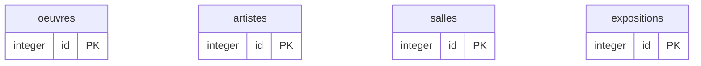

- Écartés : `cadre` non décrit, `musee` unique

</v-click>

---
layout: two-cols
---

::title::
# Faux candidats

::left::

* Une entité apparaît dès qu'on veut **décrire** un lien.

* Un accrochage a une date et un emplacement. Il devient une table.

::right::

### Le cas limite


| Candidat | Verdict | Motif |
|---|---|---|
| `musee` | Non | Exemplaire unique |
| `titre` | Non | Attribut |
| `accrochage` | Peut-être | Si daté |

---
layout: two-cols
---

::title::
# Attribut

::left::

- Il qualifie l'entité
- Il porte un type
- L'un d'eux identifie : la clé
- `PK` marque cette clé

::right::

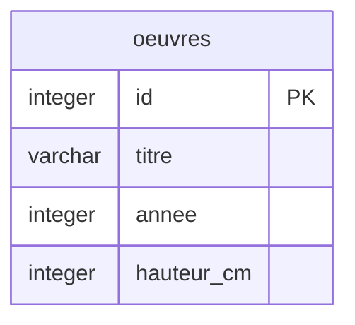

---
layout: two-cols
---

::title::
# Anatomie du cadre

::left::

| Zone | Contenu |
|---|---|
| En-tête | Nom de l'entité |
| Gauche | Type de l'attribut |
| Centre | Nom de l'attribut |
| Droite | Contrainte |

::right::

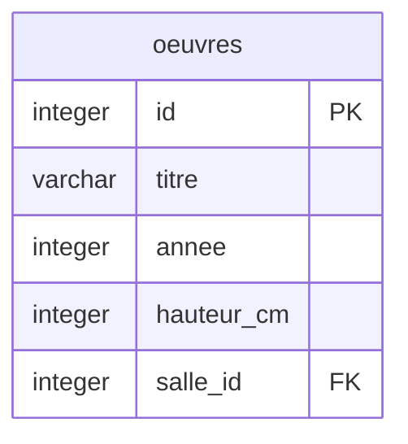

| Marqueur | Sens |
|---|---|
| `PK` | Clé primaire |
| `FK` | Clé étrangère |
| `UK` | Valeur unique |

---
layout: section
---

# Le canevas dbdiagram.io

---
layout: two-cols
---

::title::
# Gabarit d'une entité

::left::

- Un bloc par entité
- Une ligne par attribut
- `pk` marque l'identifiant
- Le diagramme se dessine à droite

| Réglage | Effet |
|---|---|
| `pk` | Clé primaire |
| `not null` | Jamais vide |
| `unique` | Non répétable |

::right::

```sql
Table nom_de_la_table {
  nom_de_colonne  type  [reglage]
  autre_colonne   type
}
```

<div class="ref">dbdiagram.io · <a href="https://dbdiagram.io/">éditeur en ligne</a></div>

---
layout: two-cols
---

::title::
# Exemple : `oeuvres`

::left::

### Le besoin

> « Chaque œuvre a un titre, une année de création, et des dimensions qu'on affiche sur le cartel. »

### La question

Quelles colonnes ? Lesquelles sont obligatoires ?

::right::

<v-click>


</v-click>

<v-click>

- `titre` obligatoire
- `annee` facultative : certaines œuvres ne sont pas datées
- `hauteur_cm` en `integer` : comparable

</v-click>

---
layout: section
---

# Types d'entités

---
layout: grid
cols: 3
content: center
---

# Forte, faible, associative

<Card title="Forte">
<template #icon><pixelarticons-archive /></template>
Identifiant propre. <code>oeuvres</code>, <code>artistes</code>.
</Card>
<Card title="Faible">
<template #icon><pixelarticons-link /></template>
Emprunte la clé de son parent.
</Card>
<Card title="Associative">
<template #icon><pixelarticons-git-branch /></template>
Naît d'une relation, porte ses attributs.
</Card>

---
layout: two-cols
---

::title::
# Clé primaire

::left::

| Type | Exemple |
|---|---|
| Technique | `id`, entier attribué par la base |
| Naturelle | `code`, valeur du métier |

### Recommandation

- Sans signification métier
- Stable dans le temps

::right::

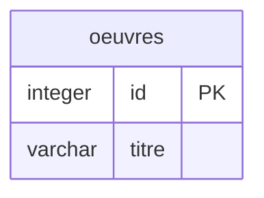

---
layout: two-cols
---

::title::
# Clé composite

::left::

- Identité portée par deux colonnes
- Le couple est unique
- Chaque colonne seule se répète
- Deux marques `PK` dans le cadre

::right::

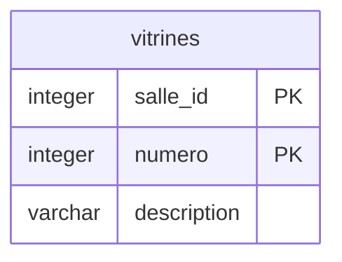

---
layout: two-cols
---

::title::
# Exemple : `vitrines`, entité faible

::left::

### Le besoin

> « On dit la vitrine 3 **de** telle salle. Le numéro repart à 1 dans chaque salle. »

### La question

Le numéro seul suffit-il à identifier une vitrine ?

::right::

<v-click>


</v-click>

<v-click>

- Non : deux salles ont une vitrine 3
- La vitrine n'existe pas sans sa salle

</v-click>

---
layout: two-cols
---

::title::
# Voies de découverte

::left::

| Voie | Déclencheur |
|---|---|
| Nom métier | Le domaine a un mot |
| Cardinalité | La relation est N:M |
| Attribut orphelin | Il n'a pas de table |

::right::

### La plus sûre

L'attribut orphelin.

La **date d'accrochage** n'appartient ni à l'œuvre, ni à l'exposition.

---
layout: two-cols
---

::title::
# Exemple : `accrochages`

::left::

### Le besoin

> « Une œuvre peut figurer dans plusieurs expositions. On veut savoir laquelle était accrochée où, et depuis quand. »

### La question

Où ranger la date d'accrochage ?

::right::

<v-click>

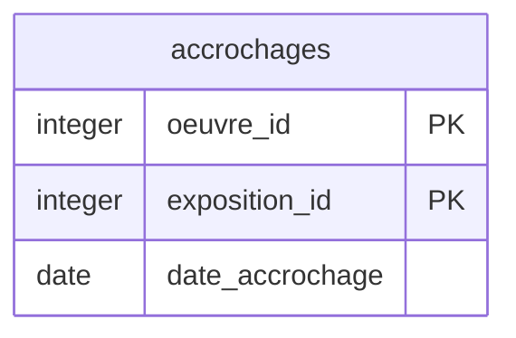

</v-click>

<v-click>

- Ni sur l'œuvre, ni sur l'exposition
- Elle décrit la **relation**

</v-click>

---
layout: two-cols
---

::title::
# Coût de l'entité faible

::left::

### Le constat

`vitrines` a une clé en deux colonnes. Toute table qui la référence hérite des deux.

Une table des emplacements aurait donc une clé en **trois** colonnes.

::right::

### Compromis

<v-click>

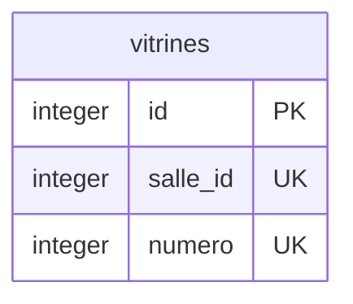

</v-click>

<v-click>

- Identifiant technique pour référencer
- `unique` conserve la règle métier

</v-click>

---
layout: two-cols
---

::title::
# Liaison contre entité associative

::left::

### Table de liaison

- Deux clés, rien d'autre
- Besoin technique
- `oeuvre_techniques`

### Entité associative

- Porte ses attributs
- Fait du métier
- `accrochages`

::right::

### Le test

Ajoutez une colonne. Le métier a-t-il quoi y mettre ?

- Oui : entité associative
- Non : table technique

### Impact

- Le SQL : rien
- Le nom et la doc : tout

---
layout: section
---

# Types d'attributs

---
layout: grid
cols: 2
content: center
---

# Simple, composé, dérivé, multivalué

<Card title="Simple">
<template #icon><pixelarticons-label /></template>
Une valeur, une colonne.
</Card>
<Card title="Composé">
<template #icon><pixelarticons-scissors /></template>
Se décompose en colonnes.
</Card>
<Card title="Dérivé">
<template #icon><pixelarticons-calculator /></template>
Se calcule, ne se stocke pas.
</Card>
<Card title="Multivalué">
<template #icon><pixelarticons-list /></template>
Devient une table.
</Card>

---
layout: two-cols
---

::title::
# Types et usages

::left::

| Type | Valeur | Permet |
|---|---|---|
| `varchar` | `'Matinale'` | Tri alphabétique |
| `integer` | `52` | Somme, moyenne |
| `decimal` | `24.5` | Calcul exact |
| `date` | `'2019-03-14'` | Intervalles |
| `boolean` | `true` | Filtrage direct |

::right::

### Le test

Qu'est-ce que je voudrai **faire** avec cette colonne ?

<Card color="#6b7280" tag="note" title="Et SQLite ?">
<template #icon><logos-sqlite /></template>
Cinq classes seulement : <code>TEXT</code>, <code>INTEGER</code>, <code>REAL</code>, <code>BLOB</code>, <code>NULL</code>. Traduction au cours 05.
</Card>

---
layout: two-cols
---

::title::
# Attribut composé

::left::

### À éviter

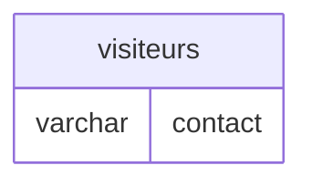

- Plusieurs valeurs en une
- Recherche par domaine impossible

::right::

### À faire

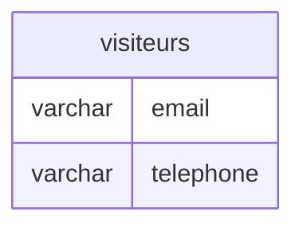

- Chaque composant interrogeable
- Chacun son type et ses contraintes

---
layout: two-cols
---

::title::
# Attribut dérivé

::left::

### À éviter

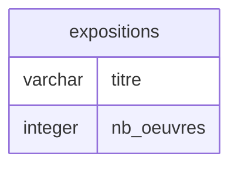

- Faux dès le prochain accrochage
- Cohérence non garantie

::right::

### À faire

```sql
SELECT titre, COUNT(*) AS nb_oeuvres
FROM expositions
JOIN accrochages ON accrochages.exposition_id = expositions.id
GROUP BY titre;
```

- Une seule source : `accrochages`
- Toujours juste

---
layout: section
---

# Nommage

---
layout: grid
cols: 2
content: center
---

# Conventions de nommage

<Card title="Pluriel">
<template #icon><pixelarticons-table /></template>
<code>oeuvres</code>, pas <code>oeuvre</code>.
</Card>
<Card title="Minuscules, underscore">
<template #icon><pixelarticons-edit-box /></template>
<code>accroche_le</code>.
</Card>
<Card title="Ni accents ni espaces">
<template #icon><pixelarticons-alert /></template>
<code>duree</code>, pas <code>durée</code>.
</Card>
<Card title="Clé étrangère suffixée">
<template #icon><pixelarticons-link /></template>
<code>oeuvre_id</code>.
</Card>

---
layout: two-cols
---

::title::
# Exemple : dictionnaire de données

::left::

### Le besoin

> « Une œuvre en réserve n'est pas exposée. Et la hauteur, c'est sans le cadre. »

### La question

Qu'est-ce qui mérite une note ?

::right::

<v-click>

| Colonne | Ce qu'il faut préciser |
|---|---|
| `hauteur_cm` | Centimètres, sans le cadre |
| `exposee` | `false` = en réserve |
| `oeuvres` | Une ligne par œuvre de la collection |

</v-click>

<v-click>

- Les unités et conventions
- Le sens de `false`

</v-click>

---
layout: section
---

# Normalisation

---
layout: grid
cols: 3
content: center
---

# Redondance et anomalies

<Card title="Insertion" color="#d97706">
<template #icon><pixelarticons-plus /></template>
Pas d'artiste sans œuvre.
</Card>
<Card title="Modification" color="#d97706">
<template #icon><pixelarticons-edit-box /></template>
Corriger partout, ou diverger.
</Card>
<Card title="Suppression" color="#e92528">
<template #icon><pixelarticons-trash /></template>
La dernière œuvre efface l'artiste.
</Card>

---
layout: two-cols
---

::title::
# Première forme normale

::left::

### La violation

| id | titre | techniques |
|---|---|---|
| 1 | Sans titre | huile, toile |
| 2 | Étude | crayon, papier |

::right::

### La règle

Une seule valeur par case.

- Recherche impossible sans découper
- Fautes de frappe indétectables
- Un attribut multivalué devient une table

<Card color="#6b7280" tag="note" title="La 1NF ne suffit pas" footer="Cours 04 · Normalisation">
<template #icon><pixelarticons-git-branch /></template>
La <strong>2NF</strong> traite les dépendances partielles, la <strong>3NF</strong> les dépendances transitives.
</Card>

---
layout: two-cols
---

::title::
# Exemple : les techniques

::left::

### Le besoin

> « On veut pouvoir lister toutes les œuvres à l'huile, sans se tromper d'orthographe. »

### La question

Une colonne suffit-elle ?

::right::

<v-click>

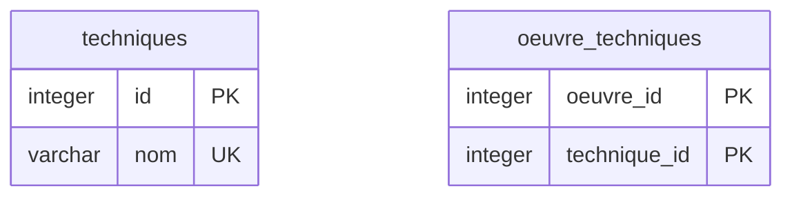

</v-click>

<v-click>

- `unique` interdit les doublons
- La liste devient une jointure

</v-click>

---
layout: section
---

# Le diagramme complet

---
layout: two-cols
---

::title::
# Ordre de construction

::left::

1. Les entités fortes
2. Les entités faibles
3. Les entités associatives
4. Les relations, cours 03

### Repère

Une entité par bloc, du plus autonome au plus dépendant.

::right::

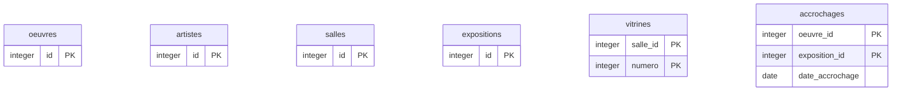

---
layout: grid
cols: 3
content: center
---

# Export du diagramme

<Card title="Compte gratuit">
<template #icon><pixelarticons-user /></template>
Nécessaire pour enregistrer un diagramme et le retrouver d'une séance à l'autre.
</Card>
<Card title="Image">
<template #icon><pixelarticons-image /></template>
Le diagramme exporté en image : la version qui se relit vite, pour réviser.
</Card>
<Card title="Fichier source">
<template #icon><pixelarticons-file /></template>
Le texte de l'éditeur, copié dans un fichier <code>.dbml</code> : de quoi reprendre le diagramme plus tard.
</Card>

---
layout: grid
cols: 3
content: center
---

# À retenir

<Card title="Le besoin précède le modèle">
<template #icon><pixelarticons-clipboard-note /></template>
On modélise ce que le client dit, pas ce qu'on imagine.
</Card>
<Card title="La clé dit le type d'entité">
<template #icon><pixelarticons-bookmark /></template>
Propre, empruntée, ou composite.
</Card>
<Card title="Trois attributs se traduisent">
<template #icon><pixelarticons-scissors /></template>
Colonnes, requête, table.
</Card>

---
layout: two-cols
---

::title::
# Pour la prochaine séance

::left::

### TP · Semaine 2

1. Reprendre la liste de la semaine 1, en tirer les entités fortes
2. Les poser dans dbdiagram.io, avec leurs attributs et leur clé
3. Repérer une entité faible ou associative, la justifier
4. Exporter l'image et le fichier source

::right::

<Card color="#16a34a" tag="tip" title="Pas encore de relations">
<template #icon><pixelarticons-git-branch /></template>
Les liens entre entités sont au cours 03. Pour l'instant, <code>artiste_id</code> est un simple <code>integer</code>.
</Card>

<Card color="#6b7280" tag="note" title="Un diagramme qui grossit">
<template #icon><pixelarticons-trending-up /></template>
Chaque séance ajoute au même diagramme ce qu'elle vient d'introduire. On ne recommence jamais de zéro.
</Card>

<div class="ref">dbdiagram.io · <a href="https://dbdiagram.io/">éditeur en ligne</a></div>
