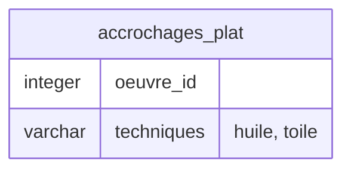
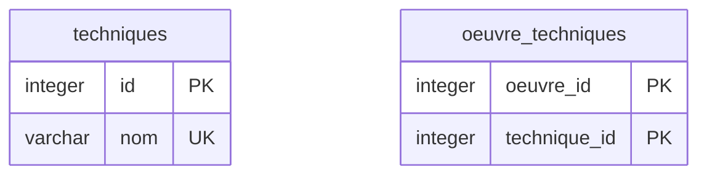
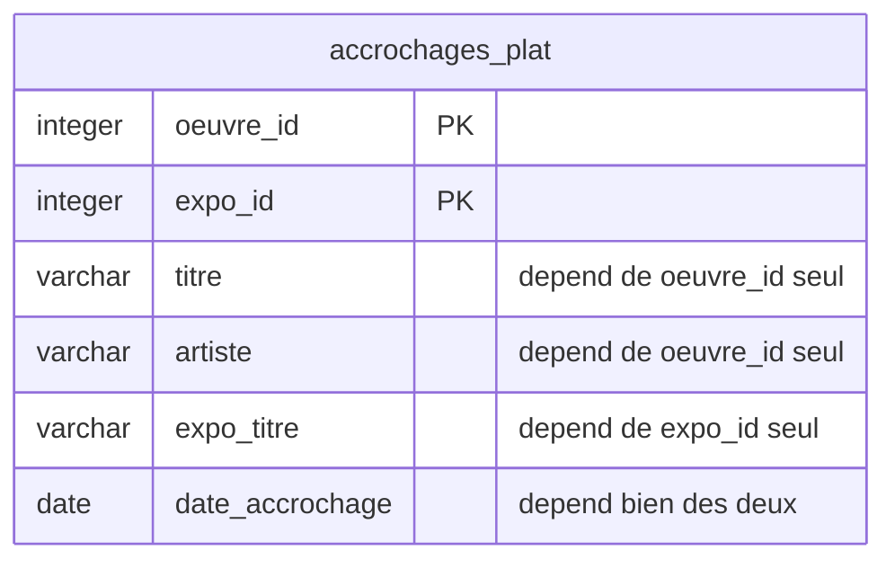
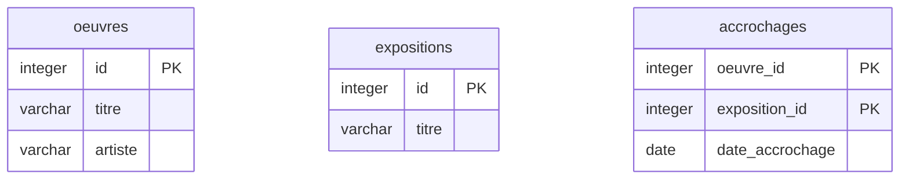
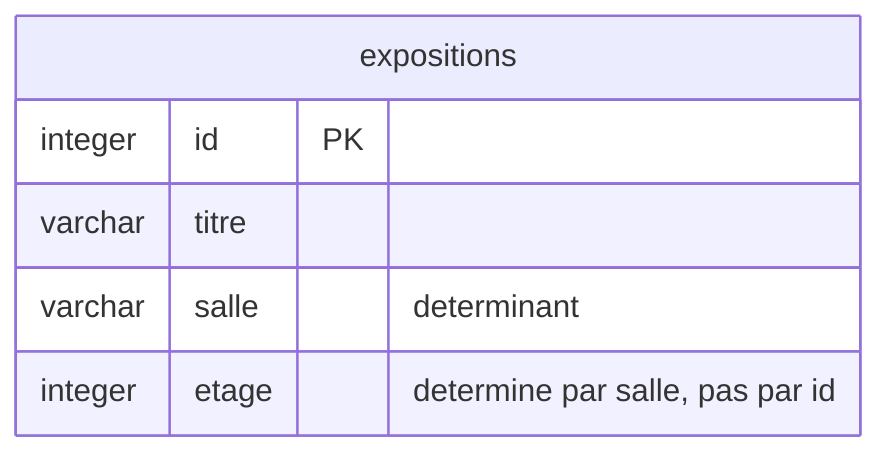
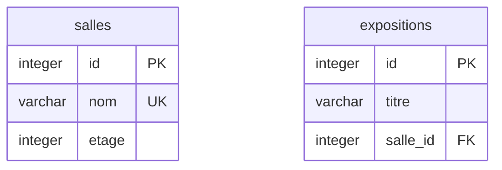
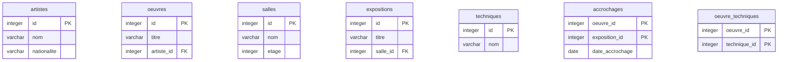

---
layout: grid
cols: 2
content: center
---

# Où on en est

Vous savez décrire des entités, des attributs et des relations. Reste une question : ce découpage est-il **le bon** ?

<Card title="Acquis des cours 02 et 03">
<template #icon><pixelarticons-check /></template>
Entités, types d'attributs, clés primaires et étrangères, cardinalités, table de liaison.
</Card>
<Card title="Objectif du jour" color="#e92528">
<template #icon><pixelarticons-scissors /></template>
Savoir <strong>prouver</strong> qu'un découpage est correct, et corriger celui qui ne l'est pas.
</Card>

---
layout: section
---

# Pourquoi normaliser

_La redondance n'est pas un gaspillage de place, c'est une source d'erreurs_

---

# Table fourre-tout

Voici le réflexe naturel quand on vient du tableur : une seule table, tout dedans.

| oeuvre_id | titre | artiste | nationalite | expo_id | expo_titre | salle | etage | techniques |
|---|---|---|---|---|---|---|---|---|
| 1 | Sans titre | Vallotton | Suisse | 10 | Regards | Nord | 1 | huile, toile |
| 1 | Sans titre | Vallotton | Suisse | 11 | Figures | Sud | 2 | huile, toile |
| 2 | Étude | Vallotton | Suisse | 10 | Regards | Nord | 1 | crayon, papier |

Elle fonctionne. Elle répond aux questions. Et elle contient déjà trois défauts structurels que ce cours va nommer, prouver et corriger.

<div class="ref">E. F. Codd, <em>A Relational Model of Data for Large Shared Data Banks</em>, Communications of the ACM (1970)</div>

---
layout: grid
cols: 3
content: center
---

# Trois anomalies

La redondance ne coûte pas de l'espace disque. Elle coûte de la **cohérence**.

<Card title="Insertion" color="#d97706">
<template #icon><pixelarticons-plus /></template>
Impossible d'enregistrer une nouvelle salle tant qu'aucune exposition n'y est programmée. La salle n'a pas de ligne à elle.
</Card>
<Card title="Modification" color="#d97706">
<template #icon><pixelarticons-edit-box /></template>
Corriger l'orthographe de <code>Vallotton</code> oblige à la corriger sur chaque ligne. Une ligne oubliée crée deux artistes.
</Card>
<Card title="Suppression" color="#e92528">
<template #icon><pixelarticons-trash /></template>
Supprimer la dernière exposition d'une salle efface l'existence même de la salle.
</Card>

---

# Découper méthodiquement

Le découpage naïf sépare au jugé. La normalisation fournit un **critère vérifiable** : chaque table ne décrit qu'un seul sujet, et chaque colonne dépend de la clé de ce sujet.

### La méthode, en trois passes

| Forme | Question posée | Défaut corrigé |
|---|---|---|
| 1NF | Chaque case contient-elle une seule valeur ? | Listes dans une colonne |
| 2NF | Chaque colonne dépend-elle de **toute** la clé ? | Dépendance partielle |
| 3NF | Chaque colonne dépend-elle **directement** de la clé ? | Dépendance transitive |

Les trois s'appliquent dans l'ordre. On ne cherche la 2NF que sur une table déjà en 1NF.

---
layout: section
---

# Dépendance fonctionnelle

_L'outil qui permet de prouver, au lieu de deviner_

---

# Définition

On dit que **A détermine B** si, connaissant A, on connaît toujours B sans ambiguïté.

```
A  ->  B
```

### Le test

Posez la question à voix haute : « si je connais A, est-ce que B est forcément la même valeur ? »

- Si je connais l'`oeuvre_id`, le `titre` est-il toujours le même ? **Oui.** Donc `oeuvre_id -> titre`.
- Si je connais le `titre`, l'`oeuvre_id` est-il toujours le même ? **Non**, deux œuvres peuvent partager un titre. Donc pas de dépendance dans ce sens.

Une dépendance fonctionnelle est une **règle du métier**, pas une observation sur les données présentes. Trois lignes qui coïncident ne prouvent rien.

---

# Exemple : dépendances relevées

Listons-les toutes avant de corriger quoi que ce soit.

```
oeuvre_id                ->  titre, artiste, nationalite
expo_id                  ->  expo_titre, salle
salle                    ->  etage
(oeuvre_id, expo_id)     ->  date_accrochage
```

### Ce que cette liste révèle

La clé de la table est le couple `(oeuvre_id, expo_id)` : il faut les deux pour désigner une ligne.

Or `titre` ne dépend que de `oeuvre_id`, et `expo_titre` ne dépend que de `expo_id`. Aucun des deux n'a besoin de la clé entière. C'est exactement ce que la 2NF interdit.

Et `etage` ne dépend de la clé par aucun chemin direct : il dépend de `salle`. C'est ce que la 3NF interdit.

---
layout: grid
cols: 2
content: center
---

# Déterminant et clé candidate

<Card title="Déterminant">
<template #icon><pixelarticons-search /></template>
La partie gauche d'une flèche. Dans <code>salle -> etage</code>, le déterminant est <code>salle</code>.
</Card>
<Card title="Clé candidate">
<template #icon><pixelarticons-bookmark /></template>
Un ensemble minimal de colonnes qui détermine <strong>toutes</strong> les autres. Une table peut en avoir plusieurs.
</Card>

La règle qui résume tout le cours : **un déterminant qui n'est pas une clé candidate signale une table à découper.**

Ici `salle` détermine `etage` sans être clé de la table. Le signal est donné : `salles` mérite sa propre table.

---
layout: section
---

# Première forme normale

_Une seule valeur par case_

---

# La règle

Une table est en 1NF quand chaque case contient **une valeur atomique** : ni liste, ni structure, ni champ fourre-tout.

### Pourquoi c'est un préalable

Sans 1NF, on ne peut même pas raisonner sur les dépendances fonctionnelles : une case qui contient trois valeurs ne détermine rien de façon univoque.

### Trois violations fréquentes

| Symptôme | Exemple |
|---|---|
| Liste séparée par des virgules | `techniques = "huile, toile"` |
| Colonnes numérotées | `technique_1`, `technique_2`, `technique_3` |
| Champ libre contenant plusieurs idées | `notes = "Restaurée en 2019, cadre d origine"` |

La deuxième est la plus sournoise : elle **paraît** atomique, mais force à choisir un maximum arbitraire.

---

# Exemple : correction 1NF

### Avant



### Après



L'attribut multivalué a produit une table de valeurs et une table de liaison. La recherche par technique redevient une simple jointure.

---
layout: section
---

# Deuxième forme normale

_Chaque colonne dépend de toute la clé_

---

# La règle

Une table est en 2NF si elle est en 1NF **et** qu'aucune colonne hors clé ne dépend seulement d'une **partie** de la clé primaire.

### Quand la question se pose

Uniquement si la clé primaire est **composite**. Une table à clé simple est automatiquement en 2NF : il n'existe pas de partie de clé à laquelle dépendre.

### Le symptôme visible

Une même valeur se répète à chaque fois que revient la même moitié de la clé. Dans la table fourre-tout, `Vallotton` réapparaît sur toutes les lignes où `oeuvre_id = 1`.

<Card color="#6b7280" tag="note" title="Le raccourci utile">
<template #icon><pixelarticons-zap /></template>
Clé primaire sur une seule colonne : la 2NF est acquise, passez directement à la 3NF.
</Card>

---

# Exemple : correction 2NF

La clé est `(oeuvre_id, expo_id)`. Or `titre` et `artiste` ne dépendent que de `oeuvre_id`.

### Avant



### Après



Ne reste dans `accrochages` que ce qui dépend vraiment du **couple**.

---
layout: section
---

# Troisième forme normale

_Aucun détour par une colonne qui n'est pas clé_

---

# La règle

Une table est en 3NF si elle est en 2NF **et** qu'aucune colonne hors clé n'en détermine une autre.

### La dépendance transitive

```
expo_id  ->  salle  ->  etage
```

`etage` dépend bien de `expo_id`, mais **en passant par** `salle`. Ce détour est la dépendance transitive que la 3NF interdit.

### La formule mnémotechnique

Chaque colonne doit dépendre de la clé, de **toute** la clé, et de **rien d'autre** que la clé.

Les trois membres correspondent exactement aux trois formes : 1NF, 2NF, 3NF.

---

# Exemple : correction 3NF

### Avant



Changer une salle d'étage obligerait à mettre à jour toutes les expositions qui s'y sont tenues. Et une salle sans exposition n'aurait aucun étage enregistré.

### Après



L'étage est désormais une propriété de la salle, enregistrée une seule fois.

---
layout: section
---

# Démarche complète

_De la table fourre-tout au modèle du musée_

---

# Résultat des trois passes

La table du début produit sept tables. Elles forment le cœur du modèle du musée.



---
layout: grid
cols: 3
content: center
---

# Trois questions

À poser sur chaque table de votre modèle, dans cet ordre.

<Card title="1NF">
<template #icon><pixelarticons-list /></template>
Une case contient-elle une <strong>liste</strong> ? Si oui, elle devient une table.
</Card>
<Card title="2NF">
<template #icon><pixelarticons-scissors /></template>
La clé est-elle <strong>composite</strong> ? Si oui, chaque colonne dépend-elle des deux moitiés ?
</Card>
<Card title="3NF">
<template #icon><pixelarticons-git-branch /></template>
Une colonne hors clé en <strong>détermine</strong>-t-elle une autre ? Si oui, elle part avec.
</Card>

En pratique, la 3NF suffit à la très grande majorité des modèles métier. Les formes supérieures traitent des cas que vous ne rencontrerez pas cette année.

---
layout: section
---

# Dénormaliser

_Savoir quand la règle mérite d'être enfreinte_

---

# Compromis lecture-écriture

La normalisation optimise l'**écriture** : une information, un seul endroit, donc aucune incohérence possible.

Elle dégrade la **lecture** : répondre à une question simple peut demander cinq jointures.

### Le compromis

| | Modèle normalisé | Modèle dénormalisé |
|---|---|---|
| Écriture | Sûre, une seule ligne à changer | Risquée, plusieurs copies à synchroniser |
| Lecture | Coûteuse, beaucoup de jointures | Rapide, tout est déjà rassemblé |
| Cohérence | Garantie par la structure | À la charge du code |

Dénormaliser est une décision **documentée et assumée**, prise après avoir mesuré un problème réel. Jamais un raccourci de conception.

---
layout: grid
cols: 3
content: center
---

# Trois cas, trois verdicts

<Card title="Valeur historique" color="#16a34a">
<template #icon><pixelarticons-clock /></template>
Le <strong>prix payé</strong> stocké sur le billet vendu. Ce n'est pas une copie du tarif courant : c'est une donnée différente, figée dans le temps. <strong>Légitime</strong>.
</Card>
<Card title="Agrégat précalculé" color="#d97706">
<template #icon><pixelarticons-calculator /></template>
Un compteur <code>nb_oeuvres</code> sur l'exposition, pour éviter un <code>COUNT</code> à chaque affichage. <strong>Acceptable si mesuré</strong>, et si la mise à jour est automatisée.
</Card>
<Card title="Copie de confort" color="#e92528">
<template #icon><pixelarticons-close /></template>
Recopier <code>artiste_nom</code> dans <code>oeuvres</code> pour « éviter une jointure ». <strong>Non</strong> : c'est la violation de 3NF qu'on vient de corriger.
</Card>

---

# La vue, alternative

Avant de dupliquer une donnée, demandez-vous si le confort de lecture ne peut pas venir d'ailleurs.

```sql
-- Le modèle reste normalisé, la lecture devient simple
CREATE VIEW catalogue AS
SELECT o.titre, a.nom AS artiste, s.nom AS salle
FROM oeuvres o
JOIN artistes a ON a.id = o.artiste_id
JOIN accrochages ac ON ac.oeuvre_id = o.id
JOIN expositions e ON e.id = ac.exposition_id
JOIN salles s ON s.id = e.salle_id;
```

Une vue donne le confort d'une table à plat **sans** la redondance : les données restent stockées une seule fois. Les vues sont au programme du cours 08.

<div class="ref">SQLite · <a href="https://www.sqlite.org/lang_createview.html">CREATE VIEW</a></div>

---
layout: grid
cols: 3
content: center
---

# À retenir

<Card title="La dépendance prouve">
<template #icon><pixelarticons-search /></template>
Écrire les flèches <code>A -&gt; B</code> transforme une intuition en démonstration.
</Card>
<Card title="La clé, toute la clé, rien que la clé">
<template #icon><pixelarticons-bookmark /></template>
Les trois membres de la formule sont les trois formes normales, dans l'ordre.
</Card>
<Card title="Dénormaliser se justifie">
<template #icon><pixelarticons-alert /></template>
Jamais par confort de conception. Uniquement après avoir mesuré, et toujours documenté.
</Card>

---

# Pour la prochaine séance

### TP · Semaine 4

1. Reprendre le diagramme du musée et **écrire les dépendances fonctionnelles** de chaque table
2. Vérifier les trois formes sur chaque table, dans l'ordre, et corriger ce qui doit l'être
3. Noter toute dénormalisation volontaire, avec sa justification
4. Exporter le diagramme corrigé : image et fichier source

<Card color="#16a34a" tag="tip" title="Le test le plus rentable">
<template #icon><pixelarticons-zap /></template>
Pour chaque colonne, demandez : <strong>de quoi dépend-elle vraiment ?</strong> Si la réponse n'est pas la clé primaire de sa table, vous tenez une anomalie.
</Card>
