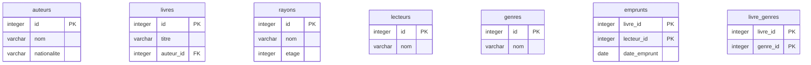

---
layout: default
---

# Cours en construction

Cette séance est en cours d'écriture. Les slides arriveront avant le cours.

<Card color="#d97706" tag="warning" title="Contenu provisoire">
<template #icon><pixelarticons-edit-box /></template>
Le plan et les premières slides existent déjà dans le dépôt, mais ne sont pas encore présentables.
</Card>


---
layout: default
hide: true
---

# Cours précédent

- La relation et sa lecture dans le diagramme
- Cardinalités `0..1`, `1`, `0..*`, `1..*`
- Clé primaire et clé étrangère
- Relations 1:N, N:M et table de liaison

<Card title="Aujourd'hui" color="#e92528">
<template #icon><pixelarticons-scissors /></template>
Savoir <strong>prouver</strong> qu'un découpage est correct, et corriger celui qui ne l'est pas.
</Card>

---
layout: section
hide: true
---

# Pourquoi normaliser

---
hide: true
---

# Table fourre-tout

Voici le réflexe naturel quand on vient du tableur : une seule table, tout dedans.

| livre_id | titre | auteur | nationalite | lecteur_id | lecteur_nom | rayon | etage | genres |
|---|---|---|---|---|---|---|---|---|
| 1 | Germinal | Zola | France | 7 | Dupont | Romans | 1 | roman, social |
| 1 | Germinal | Zola | France | 9 | Perret | Romans | 1 | roman, social |
| 2 | La Peste | Camus | France | 7 | Dupont | Romans | 1 | roman, philosophie |

Elle fonctionne. Elle répond aux questions. Et elle contient déjà trois défauts structurels que ce cours va nommer, prouver et corriger.

<div class="ref">E. F. Codd, <em>A Relational Model of Data for Large Shared Data Banks</em>, Communications of the ACM (1970)</div>

---
layout: grid
cols: 3
content: center
hide: true
---

# Trois anomalies

La redondance ne coûte pas de l'espace disque. Elle coûte de la **cohérence**.

<Card title="Insertion" color="#d97706">
<template #icon><pixelarticons-plus /></template>
Impossible d'enregistrer un nouveau rayon tant qu'aucun livre n'y est rangé. Le rayon n'a pas de ligne à lui.
</Card>
<Card title="Modification" color="#d97706">
<template #icon><pixelarticons-edit-box /></template>
Corriger l'orthographe de <code>Zola</code> oblige à la corriger sur chaque ligne. Une ligne oubliée crée deux auteurs.
</Card>
<Card title="Suppression" color="#e92528">
<template #icon><pixelarticons-trash /></template>
Supprimer le dernier emprunt d'un lecteur efface l'existence même du lecteur.
</Card>

---
hide: true
---

# Découper méthodiquement

Le découpage naïf sépare au jugé. La normalisation fournit un **critère vérifiable** : chaque table ne décrit qu'un seul sujet, et chaque colonne dépend de la clé de ce sujet.

### La méthode, en trois passes

| Forme | Question posée | Défaut corrigé |
|---|---|---|
| 1NF | Chaque case contient-elle une seule valeur ? | Listes dans une colonne |
| 2NF | Chaque colonne dépend-elle de **toute** la clé ? | Dépendance partielle |
| 3NF | Chaque colonne dépend-elle **directement** de la clé ? | Dépendance transitive |

Les trois s'appliquent dans l'ordre. On ne cherche la 2NF que sur une table déjà en 1NF.

---
layout: section
hide: true
---

# Dépendance fonctionnelle

---
hide: true
---

# Définition

On dit que **A détermine B** si, connaissant A, on connaît toujours B sans ambiguïté.

```
A  ->  B
```

### Le test

Posez la question à voix haute : « si je connais A, est-ce que B est forcément la même valeur ? »

- Si je connais le `livre_id`, le `titre` est-il toujours le même ? **Oui.** Donc `livre_id -> titre`.
- Si je connais le `titre`, le `livre_id` est-il toujours le même ? **Non**, deux livres peuvent partager un titre. Donc pas de dépendance dans ce sens.

Une dépendance fonctionnelle est une **règle du métier**, pas une observation sur les données présentes. Trois lignes qui coïncident ne prouvent rien.

---
hide: true
---

# Exemple : dépendances relevées

Listons-les toutes avant de corriger quoi que ce soit.

```
livre_id                  ->  titre, auteur, nationalite, rayon
rayon                     ->  etage
lecteur_id                ->  lecteur_nom
(livre_id, lecteur_id)    ->  date_emprunt
```

### Ce que cette liste révèle

La clé de la table est le couple `(livre_id, lecteur_id)` : il faut les deux pour désigner une ligne.

Or `titre` ne dépend que de `livre_id`, et `lecteur_nom` ne dépend que de `lecteur_id`. Aucun des deux n'a besoin de la clé entière. C'est exactement ce que la 2NF interdit.

Et `etage` ne dépend de la clé par aucun chemin direct : il dépend de `rayon`. C'est ce que la 3NF interdit.

---
layout: grid
cols: 2
content: center
hide: true
---

# Déterminant et clé candidate

<Card title="Déterminant">
<template #icon><pixelarticons-search /></template>
La partie gauche d'une flèche. Dans <code>rayon -> etage</code>, le déterminant est <code>rayon</code>.
</Card>
<Card title="Clé candidate">
<template #icon><pixelarticons-bookmark /></template>
Un ensemble minimal de colonnes qui détermine <strong>toutes</strong> les autres. Une table peut en avoir plusieurs.
</Card>

La règle qui résume tout le cours : **un déterminant qui n'est pas une clé candidate signale une table à découper.**

Ici `rayon` détermine `etage` sans être clé de la table. Le signal est donné : `rayons` mérite sa propre table.

---
layout: section
hide: true
---

# Première forme normale

---
hide: true
---

# La règle

Une table est en 1NF quand chaque case contient **une valeur atomique** : ni liste, ni structure, ni champ fourre-tout.

### Pourquoi c'est un préalable

Sans 1NF, on ne peut même pas raisonner sur les dépendances fonctionnelles : une case qui contient trois valeurs ne détermine rien de façon univoque.

### Trois violations fréquentes

| Symptôme | Exemple |
|---|---|
| Liste séparée par des virgules | `genres = "roman, social"` |
| Colonnes numérotées | `genre_1`, `genre_2`, `genre_3` |
| Champ libre contenant plusieurs idées | `notes = "Relié en 2019, edition d origine"` |

La deuxième est la plus sournoise : elle **paraît** atomique, mais force à choisir un maximum arbitraire.

---
layout: two-cols
hide: true
---

::title::
# Exemple : correction 1NF

::left::

### Avant

<ErBox
  name="emprunts_plat"
  :rows="[
    { name: 'livre_id', type: 'INTEGER' },
    { name: 'genres', type: 'VARCHAR', note: 'roman, social' },
  ]"
/>

- Une liste dans une case
- Recherche par genre impossible

::right::

### Après

<ErBox
  name="genres"
  :rows="[
    { key: 'PK', name: 'id', type: 'INTEGER', id: true },
    { key: 'UNIQUE', name: 'nom', type: 'VARCHAR' },
  ]"
/>

<ErBox
  name="livre_genres"
  :rows="[
    { key: 'PK', name: 'livre_id', type: 'INTEGER', id: true },
    { key: 'PK', name: 'genre_id', type: 'INTEGER', id: true },
  ]"
/>

- Une table de valeurs, une table de liaison
- La recherche devient une jointure

---
layout: section
hide: true
---

# Deuxième forme normale

---
hide: true
---

# La règle

Une table est en 2NF si elle est en 1NF **et** qu'aucune colonne hors clé ne dépend seulement d'une **partie** de la clé primaire.

### Quand la question se pose

Uniquement si la clé primaire est **composite**. Une table à clé simple est automatiquement en 2NF : il n'existe pas de partie de clé à laquelle dépendre.

### Le symptôme visible

Une même valeur se répète à chaque fois que revient la même moitié de la clé. Dans la table fourre-tout, `Zola` réapparaît sur toutes les lignes où `livre_id = 1`.

<Card color="#6b7280" tag="note" title="Le raccourci utile">
<template #icon><pixelarticons-zap /></template>
Clé primaire sur une seule colonne : la 2NF est acquise, passez directement à la 3NF.
</Card>

---
layout: two-cols
hide: true
---

::title::
# Exemple : correction 2NF

::left::

### Avant

<ErBox
  name="emprunts_plat"
  :rows="[
    { key: 'PK', name: 'livre_id', type: 'INTEGER', id: true },
    { key: 'PK', name: 'lecteur_id', type: 'INTEGER', id: true },
    { name: 'titre', type: 'VARCHAR', note: 'livre_id seul' },
    { name: 'auteur', type: 'VARCHAR', note: 'livre_id seul' },
    { name: 'lecteur_nom', type: 'VARCHAR', note: 'lecteur_id seul' },
    { name: 'date_emprunt', type: 'DATE', note: 'bien les deux' },
  ]"
/>

- La clé est le couple `(livre_id, lecteur_id)`
- `titre` et `auteur` n'en dépendent qu'à moitié

::right::

### Après

<ErBox
  name="livres"
  :rows="[
    { key: 'PK', name: 'id', type: 'INTEGER', id: true },
    { name: 'titre', type: 'VARCHAR' },
    { name: 'auteur', type: 'VARCHAR' },
  ]"
/>

<ErBox
  name="emprunts"
  :rows="[
    { key: 'PK', name: 'livre_id', type: 'INTEGER', id: true },
    { key: 'PK', name: 'lecteur_id', type: 'INTEGER', id: true },
    { name: 'date_emprunt', type: 'DATE' },
  ]"
/>

- Ne reste que ce qui dépend du **couple**

---
layout: section
hide: true
---

# Troisième forme normale

---
hide: true
---

# La règle

Une table est en 3NF si elle est en 2NF **et** qu'aucune colonne hors clé n'en détermine une autre.

### La dépendance transitive

```
livre_id  ->  rayon  ->  etage
```

`etage` dépend bien de `livre_id`, mais **en passant par** `rayon`. Ce détour est la dépendance transitive que la 3NF interdit.

### La formule mnémotechnique

Chaque colonne doit dépendre de la clé, de **toute** la clé, et de **rien d'autre** que la clé.

Les trois membres correspondent exactement aux trois formes : 1NF, 2NF, 3NF.

---
layout: two-cols
hide: true
---

::title::
# Exemple : correction 3NF

::left::

### Avant

<ErBox
  name="livres"
  :rows="[
    { key: 'PK', name: 'id', type: 'INTEGER', id: true },
    { name: 'titre', type: 'VARCHAR' },
    { name: 'rayon', type: 'VARCHAR', note: 'determinant' },
    { name: 'etage', type: 'INTEGER', note: 'depend de rayon' },
  ]"
/>

- Changer un rayon d'étage touche tous ses livres
- Un rayon vide n'a aucun étage enregistré

::right::

### Après

<ErBox
  name="rayons"
  :rows="[
    { key: 'PK', name: 'id', type: 'INTEGER', id: true },
    { key: 'UNIQUE', name: 'nom', type: 'VARCHAR' },
    { name: 'etage', type: 'INTEGER' },
  ]"
/>

<ErBox
  name="livres"
  :rows="[
    { key: 'PK', name: 'id', type: 'INTEGER', id: true },
    { name: 'titre', type: 'VARCHAR' },
    { key: 'FK', name: 'rayon_id', type: 'INTEGER' },
  ]"
/>

- L'étage appartient au rayon, écrit une seule fois

---
layout: section
hide: true
---

# Démarche complète

---
hide: true
---

# Résultat des trois passes

La table du début produit sept tables. Elles forment le cœur du modèle de la bibliothèque.


```mermaid {scale: 0.55}
erDiagram
  auteurs {
    integer id PK
    varchar nom
    varchar nationalite
  }
  livres {
    integer id PK
    varchar titre
    integer auteur_id FK
  }
  rayons {
    integer id PK
    varchar nom
    integer etage
  }
  lecteurs {
    integer id PK
    varchar nom
  }
  genres {
    integer id PK
    varchar nom
  }
  emprunts {
    integer livre_id PK
    integer lecteur_id PK
    date date_emprunt
  }
  livre_genres {
    integer livre_id PK
    integer genre_id PK
  }
```

---
layout: grid
cols: 3
content: center
hide: true
---

# Trois questions

À poser sur chaque table de votre modèle, dans cet ordre.

<Card title="1NF">
<template #icon><pixelarticons-list /></template>
Une case contient-elle une <strong>liste</strong> ? Si oui, elle devient une table.
</Card>
<Card title="2NF">
<template #icon><pixelarticons-scissors /></template>
La clé est-elle <strong>composite</strong> ? Si oui, chaque colonne dépend-elle des deux moitiés ?
</Card>
<Card title="3NF">
<template #icon><pixelarticons-git-branch /></template>
Une colonne hors clé en <strong>détermine</strong>-t-elle une autre ? Si oui, elle part avec.
</Card>

En pratique, la 3NF suffit à la très grande majorité des modèles métier. Les formes supérieures traitent des cas que vous ne rencontrerez pas cette année.

---
layout: section
hide: true
---

# Dénormaliser

---
hide: true
---

# Compromis lecture-écriture

La normalisation optimise l'**écriture** : une information, un seul endroit, donc aucune incohérence possible.

Elle dégrade la **lecture** : répondre à une question simple peut demander cinq jointures.

### Le compromis

| | Modèle normalisé | Modèle dénormalisé |
|---|---|---|
| Écriture | Sûre, une seule ligne à changer | Risquée, plusieurs copies à synchroniser |
| Lecture | Coûteuse, beaucoup de jointures | Rapide, tout est déjà rassemblé |
| Cohérence | Garantie par la structure | À la charge du code |

Dénormaliser est une décision **documentée et assumée**, prise après avoir mesuré un problème réel. Jamais un raccourci de conception.

---
layout: grid
cols: 3
content: center
hide: true
---

# Trois cas, trois verdicts

<Card title="Valeur historique" color="#16a34a">
<template #icon><pixelarticons-clock /></template>
La <strong>durée de prêt</strong> figée sur l'emprunt. Ce n'est pas une copie du règlement courant : c'est la règle qui s'appliquait ce jour-là. <strong>Légitime</strong>.
</Card>
<Card title="Agrégat précalculé" color="#d97706">
<template #icon><pixelarticons-calculator /></template>
Un compteur <code>nb_emprunts</code> sur le livre, pour éviter un <code>COUNT</code> à chaque affichage. <strong>Acceptable si mesuré</strong>, et si la mise à jour est automatisée.
</Card>
<Card title="Copie de confort" color="#e92528">
<template #icon><pixelarticons-close /></template>
Recopier <code>auteur_nom</code> dans <code>livres</code> pour « éviter une jointure ». <strong>Non</strong> : c'est la violation de 3NF qu'on vient de corriger.
</Card>

---
hide: true
---

# La vue, alternative

Avant de dupliquer une donnée, demandez-vous si le confort de lecture ne peut pas venir d'ailleurs.

```sql
-- Le modèle reste normalisé, la lecture devient simple
CREATE VIEW catalogue AS
SELECT l.titre, a.nom AS auteur, r.nom AS rayon, r.etage
FROM livres l
JOIN auteurs a ON a.id = l.auteur_id
JOIN rayons r ON r.id = l.rayon_id;
```

Une vue donne le confort d'une table à plat **sans** la redondance : les données restent stockées une seule fois. Les vues sont au programme du cours 08.

<div class="ref">SQLite · <a href="https://www.sqlite.org/lang_createview.html">CREATE VIEW</a></div>

---
layout: grid
cols: 3
content: center
hide: true
---

# À retenir

<Card title="La dépendance prouve">
<template #icon><pixelarticons-search /></template>
Écrire les flèches <code>A -&gt; B</code> transforme une intuition en démonstration.
</Card>
<Card title="La clé, toute la clé, rien que la clé">
<template #icon><pixelarticons-bookmark /></template>
Les trois membres de la formule sont les trois formes normales, dans l'ordre.
</Card>
<Card title="Dénormaliser se justifie">
<template #icon><pixelarticons-alert /></template>
Jamais par confort de conception. Uniquement après avoir mesuré, et toujours documenté.
</Card>

---
layout: section
hide: true
---

# Travaux pratiques

---
hide: true
---

# Pour la prochaine séance

### TP · Semaine 4

1. Reprendre le diagramme du musée et **écrire les dépendances fonctionnelles** de chaque table
2. Vérifier les trois formes sur chaque table, dans l'ordre, et corriger ce qui doit l'être
3. Noter toute dénormalisation volontaire, avec sa justification
4. Exporter le diagramme corrigé : image et fichier `.drawio`

<Card color="#16a34a" tag="tip" title="Le test le plus rentable">
<template #icon><pixelarticons-zap /></template>
Pour chaque colonne, demandez : <strong>de quoi dépend-elle vraiment ?</strong> Si la réponse n'est pas la clé primaire de sa table, vous tenez une anomalie.
</Card>
